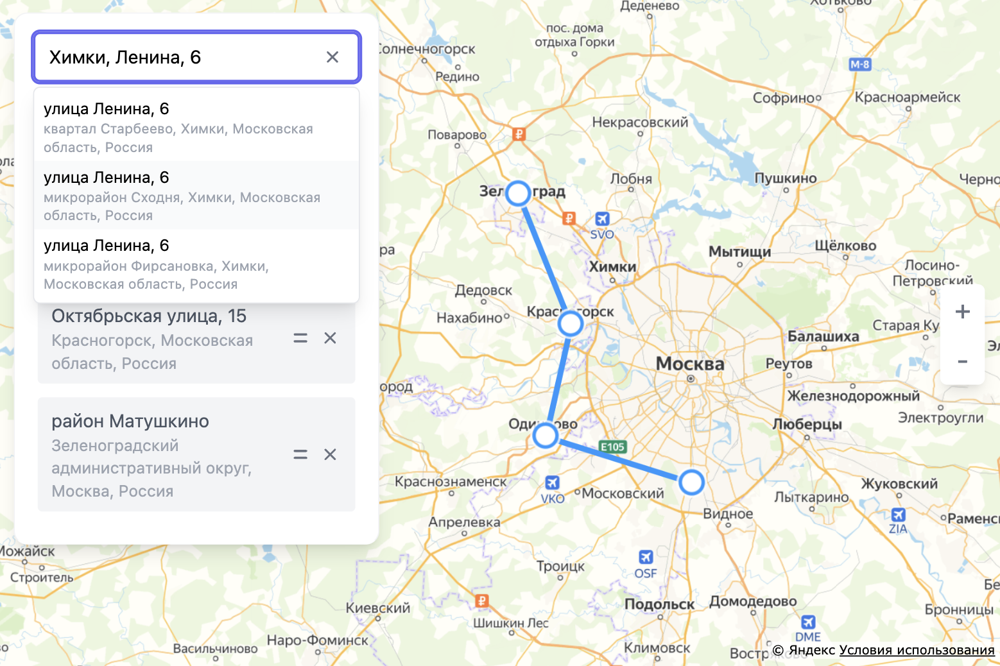

# Route editor

An implementation of [this task](https://dl.funbox.ru/qt-js.pdf).



## Dev

### First of all

Clone this repository, if you didn't it

```
git clone https://github.com/yurimikushov/route-editor.git
```

Should set environment variables in an `.env` file to correctly app usage, look an example in the [.env.example](./.env.example)

### Next steps

Install deps

```
npm i
```

Set up git hooks by `husky`

```
npm run prepare
```

Run the app in `development` mode on `localhost:3000`

```
npm run start
```

Or build the app for `production` to the `build` folder

```
npm run build
```
